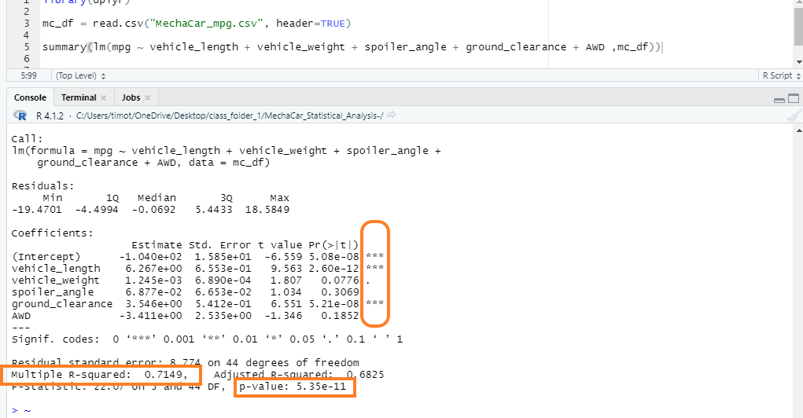
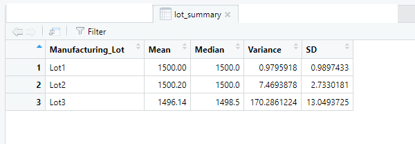
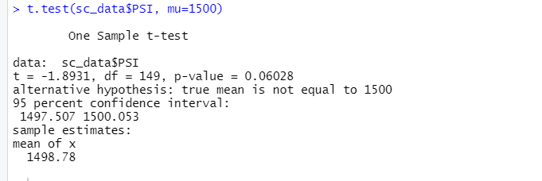
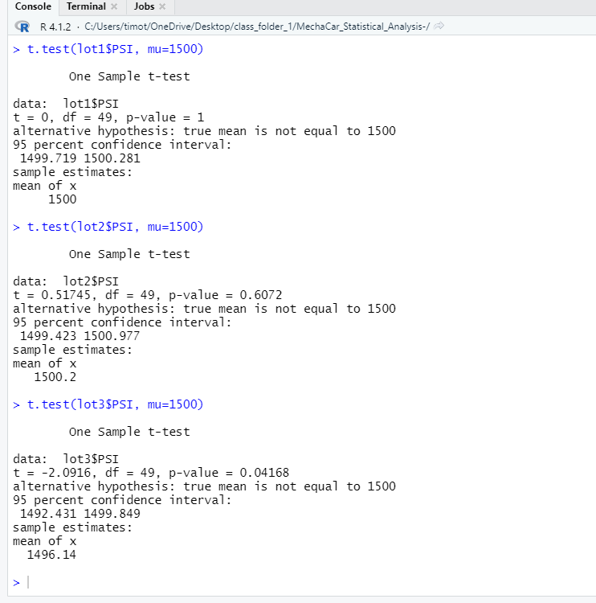

# MechaCar_Statistical_Analysis

## Deliverable 1: Linear Regression to Predict MPG
Vehicle Length and Ground Clearance variables both provide a non-random amount of variance to the mpg values in the dataset.  Vehicle Weight was close, but outside of the 0.05 limit.

The slope of the linear model is not zero.  Our R-squared value is 0.7149, which means tyhat over 70% of the variability of mpg is explained using this linear model.  The p-value of 5.35x10-11 is so small that it provides us sufficient evidence to reject the hypothesis of the slope being zero.

This linear model effectively predicts the mpg of MechaCar prototypes, because of the extremely small p-value.

## Deliverable 2: Summary Statistics on Suspension Coils
The design specifications for the MechaCar suspension coils dictate that the variance of the suspension coils must not exceed 100 pounds per square inch.

The current manufacturing data, overall, does meet this specification.  See this overall variance of 62.29356 -->

Lot1 and Lot2 meet the variance specification, but Lot3 does not.  See this Lot3 variance of 170+ -->

## Deliverable 3: T-Test on Suspension Coils
Across all Manufacturing Lots, the mean PSI is shown to be 1498.78, not 1500 -->

For Manufacturing Lot 1, we found that the mean PSI was 1500.  
For Manufacturing Lot 2, we found that the mean PSI was 1500.2.  
For Manufacturing Lot 3, we found that the mean PSI was 1496.14.  

## Deliverable 4: Design a Study Comparing the MechaCar to the Competition

